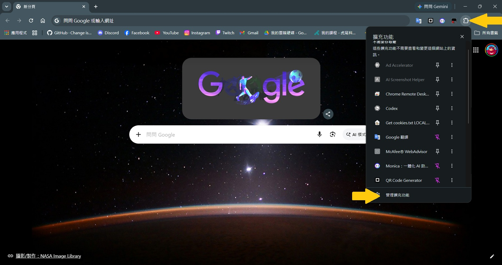
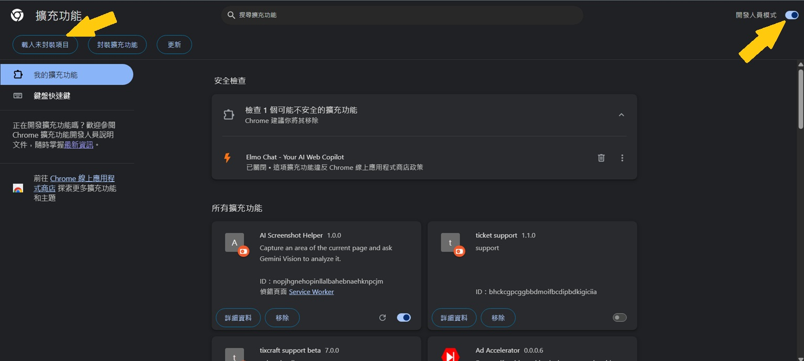
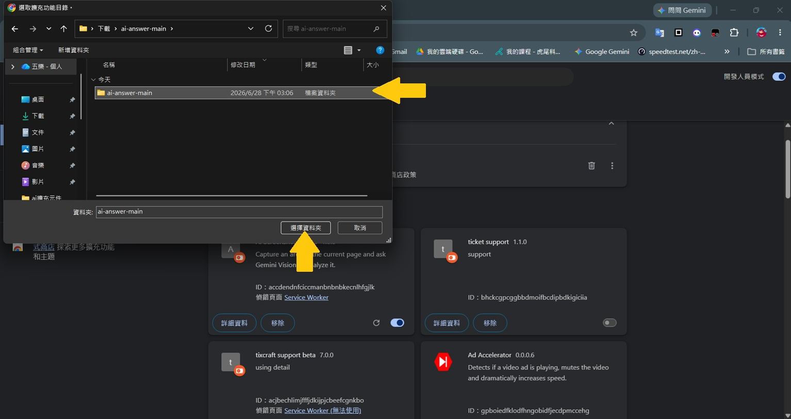

# AI Screenshot Helper

AI Screenshot Helper 是一個 Chrome 擴充功能，可以讓你在網頁上框選畫面截圖，並把截圖和你的問題一起送到 Gemini Vision 進行分析。

> [!IMPORTANT]
> 本軟體僅供教育研究用途。使用者需自行確認使用情境是否合法、是否符合學校或平台規範，並自行承擔使用本工具所產生的責任。

## 功能特色

- 在網頁右下角顯示可拖曳的 AI 浮動面板。
- 支援選取網頁局部畫面截圖。
- 可以輸入問題，搭配截圖送到 Gemini 分析。
- 可自訂 Gemini 模型名稱。
- Gemini API Key 只會儲存在本機 Chrome 擴充功能儲存空間。
- 支援快捷鍵 `Ctrl+Shift+1` 開始截圖。

## 教學文件

- [如何申請 Gemini API Key](docs/GEMINI_API_KEY.md)
- [Ulearn 使用示範](docs/ULEARN_USAGE.md)

## 從零開始安裝

### 1. 下載專案

如果你熟悉 Git，可以使用：

```powershell
git clone https://github.com/你的帳號/你的repo.git
```

也可以在 GitHub 頁面點選 **Code**，再點 **Download ZIP**，下載後解壓縮。

### 2. 開啟 Chrome 擴充功能頁面

在 Chrome 網址列輸入：

```text
chrome://extensions
```

### 3. 開啟開發人員模式

在右上角打開 **開發人員模式**。



### 4. 載入未封裝項目

點選 **載入未封裝項目**。



### 5. 選擇專案資料夾

選擇這個專案資料夾，也就是包含 `manifest.json` 的那一層資料夾。



### 6. 設定 Gemini API Key

安裝完成後，打開任意一般網頁，右下角會出現 AI Screenshot Helper 的小按鈕。

打開面板後，在 **Gemini API 設定** 裡貼上你的 API Key，然後按 **儲存**。

如果你還沒有 API Key，請看這份教學：

[如何申請 Gemini API Key](docs/GEMINI_API_KEY.md)

### 7. 開始使用

1. 開啟任意一般網頁。
2. 點開右下角的 AI Screenshot Helper。
3. 按 **截圖**，或按快捷鍵 `Ctrl+Shift+1`。
4. 用滑鼠拖曳選取想分析的畫面區域。
5. 輸入你的問題。
6. 按 **送出**，等待 Gemini 回覆。

更完整的操作示範請看：

[Ulearn 使用示範](docs/ULEARN_USAGE.md)

## Gemini 模型設定

預設模型是：

```text
gemini-flash-latest
```

如果你的 API Key 無法使用這個模型，可以在面板中的模型欄位改成其他可用模型，例如：

```text
gemini-2.5-flash
```

## 權限說明

這個擴充功能會要求以下權限：

- `activeTab`：在你主動截圖時，擷取目前分頁畫面。
- `storage`：在本機儲存 Gemini API Key 與模型名稱。
- `scripting`：讓擴充功能可以在網頁中顯示操作面板。
- `<all_urls>`：讓操作面板可以出現在一般網頁上。

## 隱私說明

Gemini API Key 只會儲存在 Chrome 的本機擴充功能儲存空間，也就是 `chrome.storage.local`。

這個專案不會把你的 API Key 存進程式碼，也不會上傳到 GitHub。

只有在你按下 **送出** 時，截圖內容與文字問題才會送到 Google Gemini API。

## 常見問題

### Gemini API 顯示 high demand

如果出現類似訊息：

```text
This model is currently experiencing high demand. Spikes in demand are usually temporary. Please try again later.
```

代表目前模型需求量較高，通常是暫時性的。你可以稍後再試，或改用其他可用模型。

### 回覆被中斷或內容不完整

可能是模型負載過高、輸入內容太長，或截圖中的資訊太多。可以嘗試：

- 縮小截圖範圍，只截需要分析的區塊。
- 簡化問題。
- 稍後再送出一次。

### 出現 token 或內容長度相關錯誤

請減少截圖範圍或縮短提問文字。截圖越大、文字越多，模型需要處理的內容就越多。

### 模型名稱不能使用

如果你填的模型名稱無法使用，請改回：

```text
gemini-flash-latest
```

或嘗試：

```text
gemini-2.5-flash
```

可用模型會依 Google 帳號、地區、API 狀態而不同。

## 專案結構

```text
.
├── background.js
├── content.js
├── manifest.json
├── style.css
├── ui.html
├── README.md
├── LICENSE
├── docs/
│   ├── GEMINI_API_KEY.md
│   └── ULEARN_USAGE.md
└── 新增資料夾/
    ├── step1.jpg
    ├── step2.jpg
    ├── step3.jpg
    ├── step4.jpg
    ├── step5.jpg
    ├── step5-1.jpg
    ├── stepA.jpg
    ├── stepB.jpg
    ├── stepC.jpg
    ├── step甲.jpg
    ├── step乙.jpg
    ├── step丙.jpg
    └── step丁.jpg
```

## 開發方式

這個專案沒有 build step。修改檔案後，到 `chrome://extensions` 按重新載入即可測試。

## License

本專案採用 MIT License。詳見 [LICENSE](LICENSE)。
