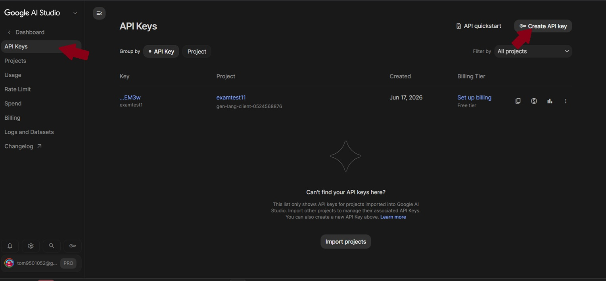
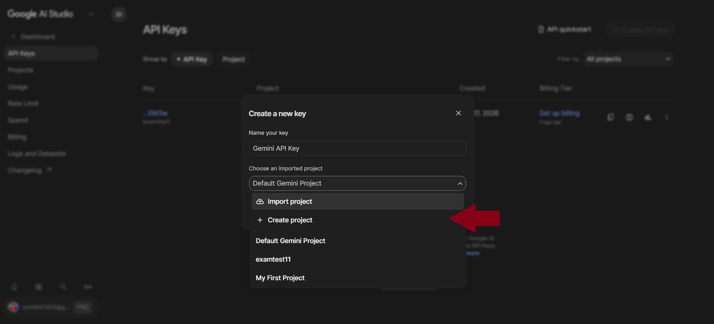
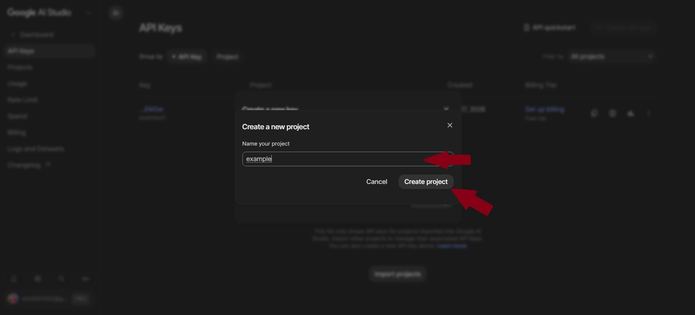
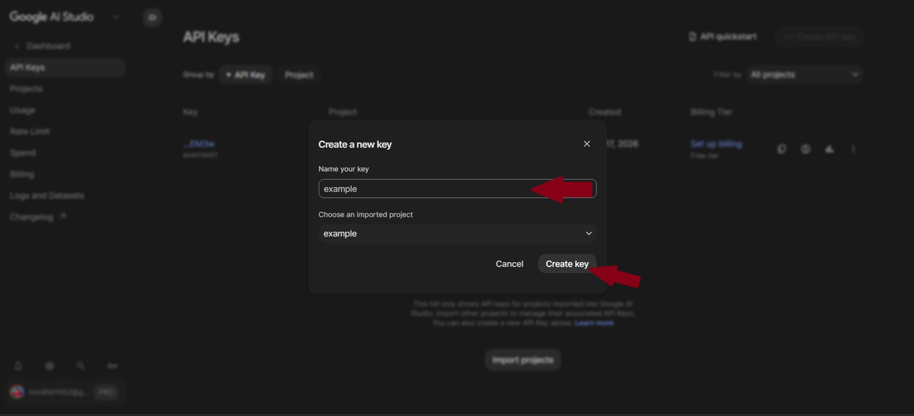
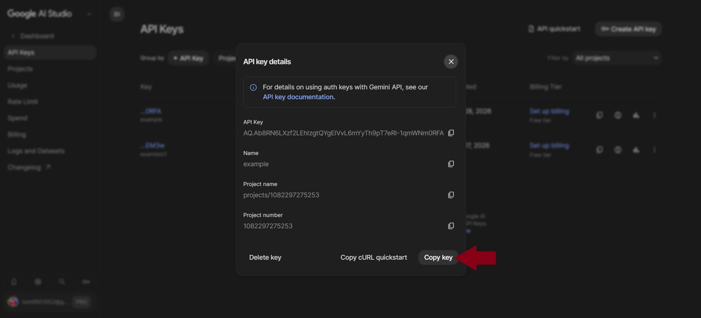
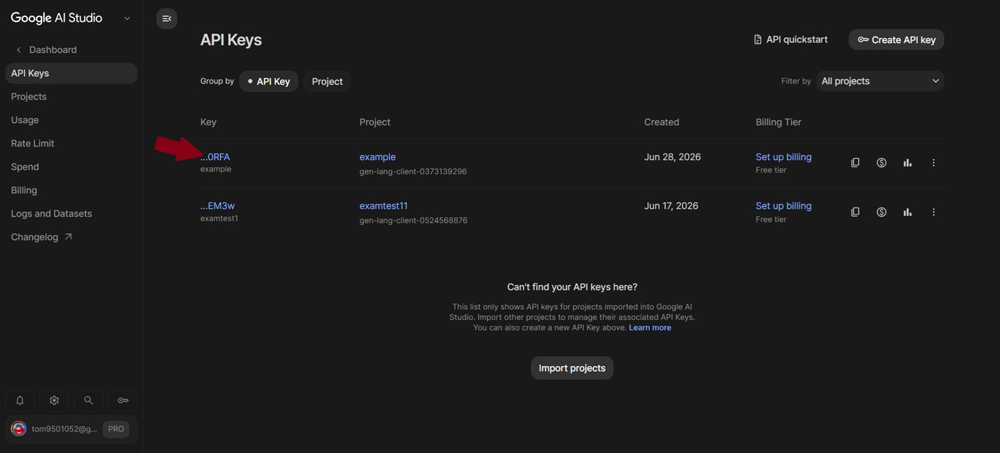

# 如何申請 Gemini API Key

這份教學會帶你從零開始申請 Gemini API Key，並把它填入 AI Screenshot Helper。

> [!WARNING]
> 請不要把自己的 API Key 公開到 GitHub、社群網站、教學截圖或任何公開地方。API Key 可能會產生用量與費用，請妥善保管。

## 事前準備

你需要：

- 一個 Google 帳號
- Chrome 瀏覽器
- 可以使用 Google AI Studio 的網路環境

## 1. 開啟 Google AI Studio

前往 Google AI Studio：

[https://aistudio.google.com/](https://aistudio.google.com/)

登入你的 Google 帳號。



## 2. 進入 API Key 頁面

在 Google AI Studio 中，找到 **Get API key** 或 **API keys**。

如果畫面改版，可以尋找和 API Key、金鑰、開發者設定相關的選項。



## 3. 建立新的 API Key

點選 **Create API key**。

Google 可能會要求你選擇或建立一個 Google Cloud 專案。依照畫面指示建立即可。



## 4. 選擇或建立專案

如果 Google AI Studio 要求你選擇 Google Cloud 專案，可以選擇既有專案，或依照畫面建立新的專案。



## 5. 複製 API Key

建立完成後，你會看到一串 API Key。請複製這組金鑰。



如果畫面有額外的確認或設定步驟，依照頁面提示完成。



## 6. 貼到 AI Screenshot Helper

1. 回到 Chrome。
2. 打開任意一般網頁。
3. 點開右下角的 AI Screenshot Helper 面板。
4. 展開 **Gemini API 設定**。
5. 將 API Key 貼到輸入框。
6. 按 **儲存**。

完成後就可以截圖並送出問題。

## 7. 測試是否成功

你可以先選取一小塊網頁畫面，然後輸入：

```text
請描述這張截圖裡有什麼。
```

如果 Gemini 正常回覆，代表 API Key 設定成功。

## 常見問題

### 出現模型不存在或不支援

請嘗試把模型名稱改成：

```text
gemini-2.5-flash
```

或回到 Google AI Studio 確認你的 API Key 可用的模型。

### 出現 API Key 錯誤

請確認：

- API Key 沒有多複製空白或換行。
- API Key 沒有被刪除或停用。
- 你的 Google 帳號與專案可以使用 Gemini API。

### 需要付費嗎

Gemini API 的免費額度與計費方式可能會變動，請以 Google 官方頁面為準。

在公開專案中，不要提供自己的 API Key 給其他人使用。
